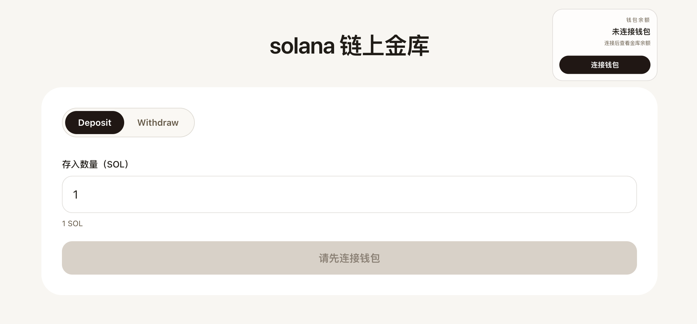
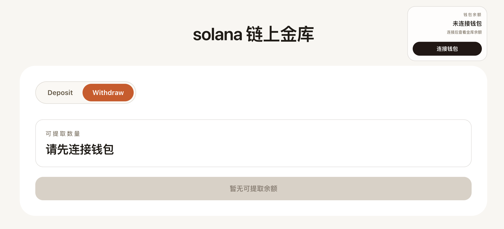
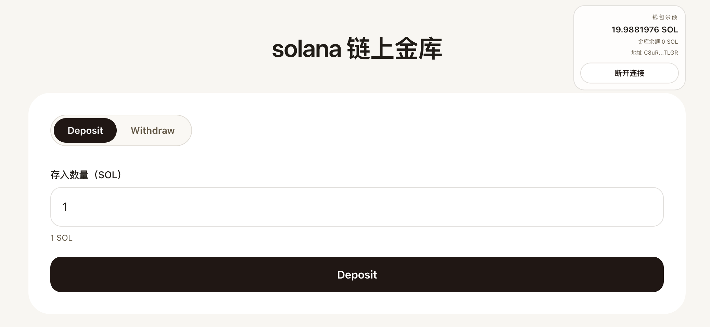
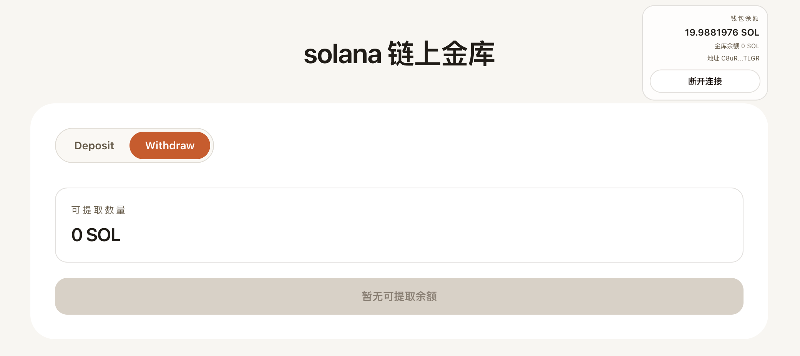
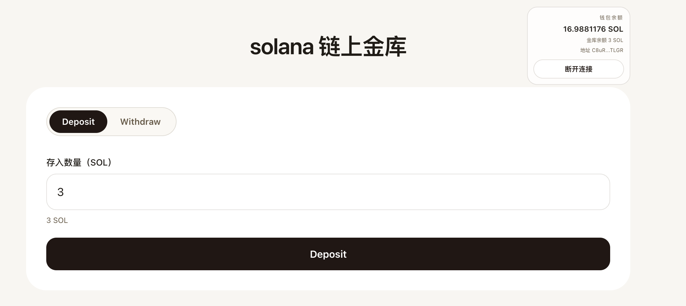
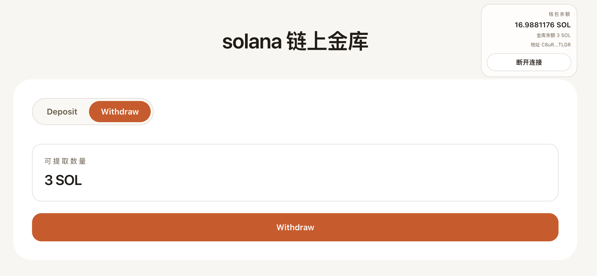
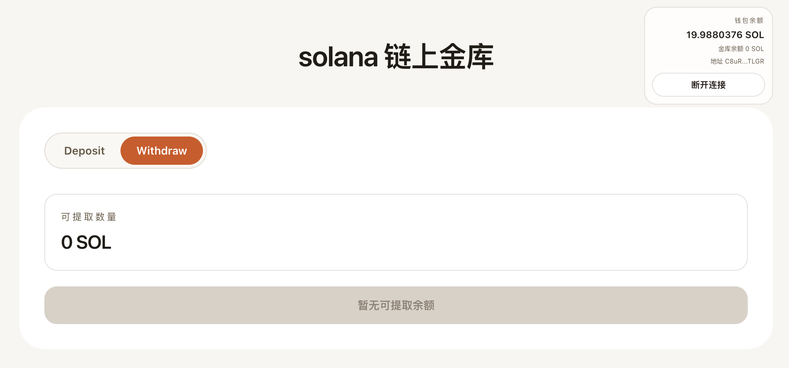

# valut-app

这是 value 合约的前端项目，基于 Next.js 和 `@solana/react-hooks`，默认连接 Solana devnet，支持：

- 浏览器钱包连接 / 断开
- 自动推导并展示单个 value 金库 PDA
- 调用 value 合约的 deposit / withdraw 指令
- 显示钱包余额和金库余额

## 1. 部署合约到 devnet

在仓库根目录执行：

```bash
cargo build-sbf
solana config set --url https://api.devnet.solana.com
solana balance
```

如果余额不足，先申请 devnet 空投：

```bash
solana airdrop 2
solana balance
```

然后部署程序：

```bash
solana program deploy target/deploy/value.so
```

当前程序地址固定为：

```text
BGV2SH7HUa6vfnY88UEqVwwLEoxPLXkafZVSM11H2arB
```

## 2. 启动前端

进入前端目录：

```bash
cd valut-app
npm install
npm run dev
```

启动后访问：

```text
http://localhost:3000
```

## 3. 环境变量

默认值已经是 devnet。如果你要覆盖，也可以在本地 shell 中设置：

```bash
export NEXT_PUBLIC_SOLANA_RPC_URL=https://api.devnet.solana.com
export NEXT_PUBLIC_VALUE_PROGRAM_ID=BGV2SH7HUa6vfnY88UEqVwwLEoxPLXkafZVSM11H2arB
```

## 4. 页面交互说明

### Wallet connection

- 页面会自动发现浏览器钱包连接器
- 连接后会显示钱包地址和余额

### Deposit

- 输入 SOL 数量
- 点击“执行 Deposit”
- 前端会调用程序的 `0x00` 指令，把 SOL 转入 seed:`value` 的 PDA

### Withdraw

- 现在 deposit 和 withdraw 都使用同一个 seed:`value` 的 PDA
- 页面会直接调用 `0x01` 指令从这个金库中提取全部余额

## 5. 如何测试

### 前端静态检查

```bash
npm run lint
npm run build
```

### 合约测试

在仓库根目录运行：

```bash
cargo test
cargo test -- --ignored
```

其中：

- `cargo test` 会跑 LiteSVM 和 Mollusk 测试
- `cargo test -- --ignored` 会跑 Surfpool 测试

### devnet 联调建议流程

1. `solana config set --url https://api.devnet.solana.com`
2. 确认钱包有 devnet SOL
3. 部署 `target/deploy/value.so`
4. 启动前端 `npm run dev`
5. 浏览器钱包切换到 devnet
6. 执行 Deposit，确认金库余额增加
7. 执行 Withdraw，确认钱包取回金库里的余额

## 6. 说明

前端已经同步到“deposit / withdraw 共用同一个 value PDA”的实现。

## 7.效果





















